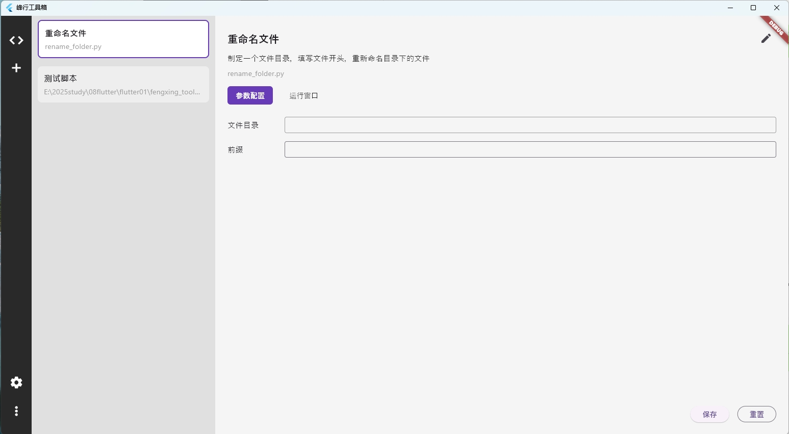
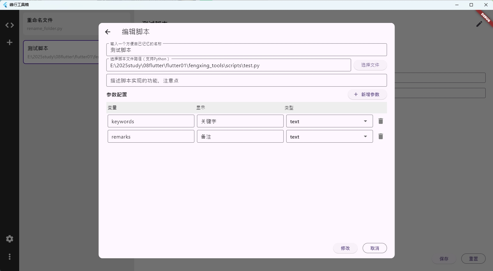
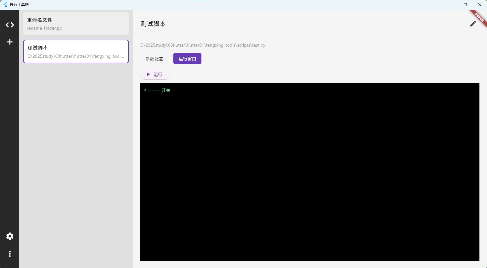

# fengxing_tools 峰行工具箱
这是一个用Flutter实现的桌面端应用，可以维护经常使用的python脚本，填写并记录常用的参数，需要的时候，一键点击即可运行，减少对记忆的依赖。实事求是的说，整个应用的99%的代码，都是用AI做的，所以AI真的很强，即使我不会Flutter，用1个小时看看Flutter的入门文档，调教好AI就可以为我工作了。
> 开发工具：vscode + 自带的GPT-4.1

### 为什么会有这个项目
作为一个程序员，平时遇到一些“重复性”工作，就想写点脚本、小工具啥的，但是呢，过了这个窗口期，可能就留在电脑里吃土了。眨眼间过去了好长时间，又遇到了同样的需求，然而，我特么忘了脚本放哪了...或者赖得打开IDE看参数...所以，我就想搞个工具箱，让它帮我管理脚本，记住参数，我只想点一个"运行"就够了。

### 功能介绍
1. 以列表方式，显示本地维护的脚本。注意：完全本地运行，不会上传到互联网上！！！
2. 自由编辑参数，并保存到本地，下次再运行时自动填充。
3. 预留了设置和更多菜单，大家自行折腾。

### 系统截图




### 关于升级计划
没有明确的升级计划，想到了再说

### 脚本合集
1. 工程下有个scripts目录，将来我的脚本会同步更新，也欢迎大家提交脚本。
2. test.py用来测试的，没有实际用途。

### 常见问题
1. flutter pub get总是报错"exit code 69"
> 设置一下系统变量，添加以下两个，跟path平级，不要添加到path里
```txt
PUB_HOSTED_URL    https://pub.flutter-io.cn
FLUTTER_STORAGE_BASE_URL  https://storage.flutter-io.cn
```

执行以下命令
```dart
flutter clean
flutter pub get
```

### 联系我
158712444@qq.com